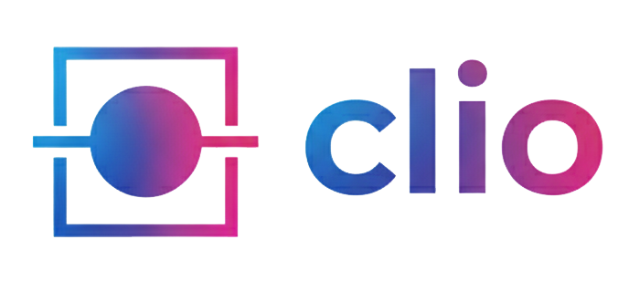

# clio

> A professional research platform for exploring The National Archives (TNA) catalogue with modern UX, AI search, and rigorous provenance — built with care for scholars and practitioners.

[](https://github.com/rtw878/national-archives-discovery-clone)
[](LICENSE)
[](https://python.org)

---

## Brand

<div align="center" style="margin: 20px 0;">
  
  <br/>
  
</div>

- Primary mark: `web/static/images/logo.png`
- Symbol: `web/static/images/logo-symbol.png`
- Favicons/app icons: `web/static/images/favicon.png`
- Full asset set: `logos/` (wordmark, symbol, transparent variants)

Color system and tokens are codified in `web/static/css/main.css` and summarized in `BRAND_KIT.md`.

---

## What is clio?

clio is a modern, local-first research platform that mirrors public metadata from TNA Discovery (respecting access/rate policies), adds powerful search (including semantic/AI options), and presents a clean, fast web interface for exploration.

- Elegant web UI with professional typography and brand components
- Local database for instant search and offline operation
- Semantic search engine (optional) for natural-language discovery
- Data quality tooling, validation, and provenance awareness
- Respectful API usage with strict rate limiting and logging

---

## Quick start

```bash
# 1) Clone
git clone https://github.com/rtw878/national-archives-discovery-clone.git
cd national-archives-discovery-clone

# 2) Install
pip install -r requirements.txt

# 3) Configure IP allowlisting for TNA (see BRAND_KIT.md and The TNA API Bible)
#    Create config.env with your details if required
copy config.env.example config.env

# 4) Verify and run
python main.py stats
python main.py serve --port 8080
# Open http://localhost:8080
```

---

## Core commands

| Command | Purpose |
|--------|---------|
| `python main.py serve` | Start clio web interface |
| `python main.py fetch "term"` | Fetch records from TNA and store locally |
| `python main.py search "query"` | Full‑text search of local DB |
| `python main.py index` | Build semantic index (optional) |
| `python main.py validate --type full` | Run data validation suite |
| `python main.py stats` | Local DB size, API usage, cache stats |

See `cli/main.py` for a comprehensive set of advanced commands (batching, traversal, health monitoring, streaming, export, backups).

---

## Design system (highlights)

- Brand gradient: cyan → purple → magenta (`--gradient-brand`) for primary CTAs
- Neutral, high‑contrast surfaces, large rounded radii, soft shadows
- Inter/Sans stack for legibility; accessible focus states
- Components: navigation, hero, cards, badges, alerts, stats tiles

Fonts, colors, spacing and shadow tokens are centralized in `web/static/css/main.css`. For visual and usage guidelines, see `BRAND_KIT.md`.

---

## Architecture

- `web/` FastAPI app + Jinja templates + premium CSS
- `api/` robust HTTP client with rate limiting, retries, and endpoint helpers
- `storage/` SQLite database with FTS5 and a simple caching layer
- `search/` optional semantic search engine
- `validation/` validators and reporting
- `utils/` backup, streaming, exporters, provenance

---

## Compliance & ethics

clio operates within TNA guidance:
- 1 request/sec; conservative client-side throttling
- IP allowlisting where applicable
- Clear provenance and respectful usage

Consult: `The TNA API Bible - A Definitive Guide for AI Agents.md`.

---

## Brand assets

- Logos and marks: `logos/`
- UI identity: `web/static/images/*`
- Color & typography: `web/static/css/main.css`
- Guidelines: `BRAND_KIT.md`

If you need exports for presentations (SVG/PNG at various sizes), open an issue and we will add a `/brand` folder with pre‑baked assets.

---

## License

MIT — see `LICENSE`.